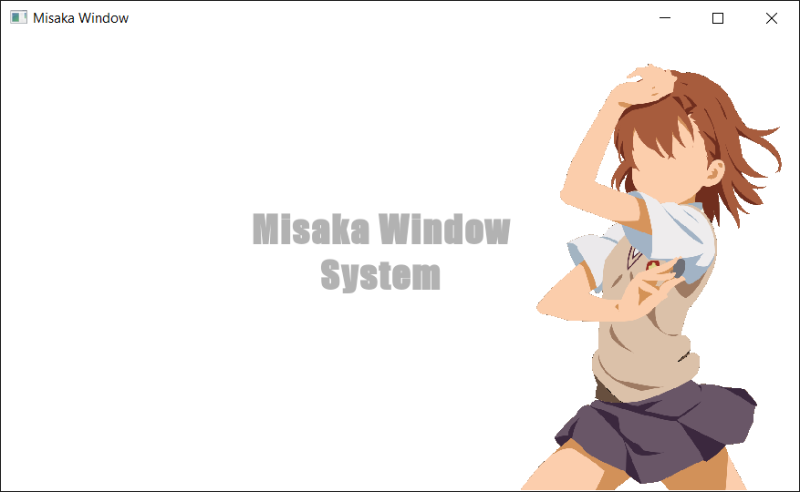

# Misaka Window System
Static C++ library for creating window that will be used in combination with DirectX or OpenGL projects. Also provides interface for keyboard and mouse events.

This library is still in development and will be more expanded in future.
> :warning: **Not to be used in production!**
<p align="center">
    <br>
    
</p>

## Structure
Misaka window system consists for three main classes:

* Window
* Keyboard
* Mouse

## Window class
Protected Fields:

```.cpp
HWND mhWnd;                     // Window handle.
MSG mMsg;                       // Message information.

int miWidth;                    // Window width.
int miHeight;                   // Window height.
bool mbResized;                 // Window resized.
static inline Window* mWindow;  // Single window instance.
```

Public Methods:

```.cpp
// Creates and returns window instance.
static Window* CreateWindowInstance(INT iWidth, INT iHeight, LPCWSTR lpTitle, Configuration config); 
static Window* GetInstance();   // Returns windows signle instance.

bool IsAlive();                 // Check if window is not destroyed.
void PollEvents();              // Poll events.
bool IsResized();               // Getter for window resize.
int GetWidth();                 // Getter for window width.
int GetHeight();                // Getter for window height.
HWND GetHandle();               // Getter for window handle.
void Close();                   // Destroy window.

virtual ~Window();              // Destructor.
```

Protected Methods:

```.cpp
explicit Window() = delete;
// Window constructor.
explicit Window(INT iWidth, INT iHeight, LPCWSTR lpTitle, Configuration config);    

// Handling window messages.
static LRESULT CALLBACK WindowProc(HWND hWnd, UINT message, WPARAM wParam, LPARAM lParam);  
```

Inline class for handling window configuration:
```.cpp
struct Configuration : public WNDCLASSEX
{
    INT iShowCmd;   // Display cmd.
    explicit Configuration(HINSTANCE hInstance, INT iShowCmd);
};
```

## Keyboard class
Protected Fields:

```.cpp
Action meActions[255];              // Actions for all keys.
static inline Keyboard* mKeyboard;  // Single keyboard instance.
```

Public Methods:

```.cpp
// Create and return single keyboard instance.
static Keyboard* CreateKeyboardInstance();  
static Keyboard* GetInstance(); // Return single keyboard instance.

bool IsKeyDown(INT iKey);       // Check if provided key is held down.
Action GetAction(INT iKey);     // Get action for provided key.
void ResetState();              // Reset state for all keys.

virtual ~Keyboard();            // Destructor
```

Protected Methods:
```
explicit Keyboard();            // Constructor.
```

## Mouse class
Protected Fields:

```.cpp
Action mActions[3];             // Actions for mouse buttons.
POINT mPoint;                   // Cursor position.
INT miScroll;                   // Scroll offset.

static inline Mouse* mMouse;    // Single mouse instance.
```

Public Methods:

```.cpp
static Mouse* CreateMouseInstance();    // Create and return single mouse instance.
static Mouse* GetInstance();            // Return single mouse instance.

int GetScroll();            // Get scroll offset.
Action GetLeftButton();     // Get left button action.
Action GetRightButton();    // Get right button action.
Action GetMiddleButton();   // Get middle button action.

int GetPosX();              // Get cursor position on x axis.
int GetPosY();              // Get cursor position on y axis.
bool IsDown(INT iButton);   // Check if provided button is down.
void ResetState();          // Reset state for all buttons.

virtual ~Mouse();           // Destructor.
```

Protected Methods:

```.cpp
explicit Mouse();   // Constructor
```

## Creating window example

```.cpp
#include <MisakaWindowSystem.h>

INT WINAPI Misaka::Main(HINSTANCE hInstance, HINSTANCE hPrevInstance, LPSTR lpCmdLine, INT iShowCmd)
{
    Misaka::Window::Configuration conf(hInstance, iShowCmd);
    Misaka::Window* win = Misaka::Window::CreateWindowInstance(700, 400, L"Misaka Window", conf);
    Misaka::Keyboard* kbd = Misaka::Keyboard::CreateKeyboardInstance();
    Misaka::Mouse* mouse = Misaka::Mouse::CreateMouseInstance();

    while (win->IsAlive())
    {
        win->PollEvents();
        mouse->ResetState();
        kbd->ResetState();
    }
    
    delete win;
    delete kbd;
    delete mouse;
    return MISAKA_QUIT_OK;
}

MISAKA_RUN_APPLICATION;
```